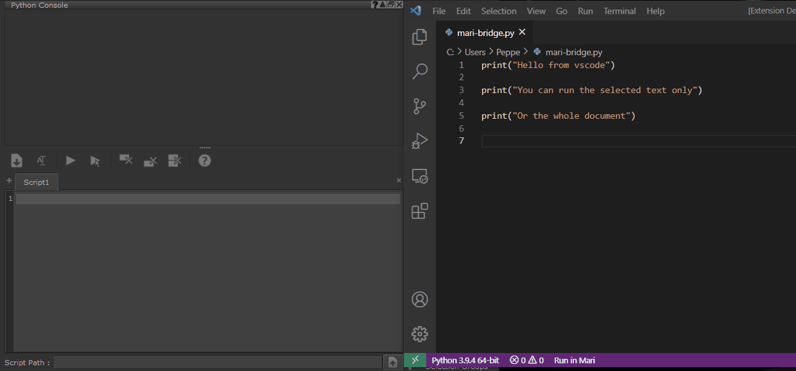

# mari-bridge README

This extension allows you to run code from Visual Studio Code directly in Mari

## Requirements

To use this extension you need a licende installation of Mari, with the command port enabled.
To enable the command port go to `Edit > Preferences > Scripts > Mari Command port` and check `Enabled` and `Local Host Only`

## Extension Settings

* `mari-bridge.host`: The host to use for the connection, defaults to `localhost`
* `mari-bridge.port`: The port to use for the connection, defaults to `6100`

## Release Notes

### 0.0.1
Initial release
